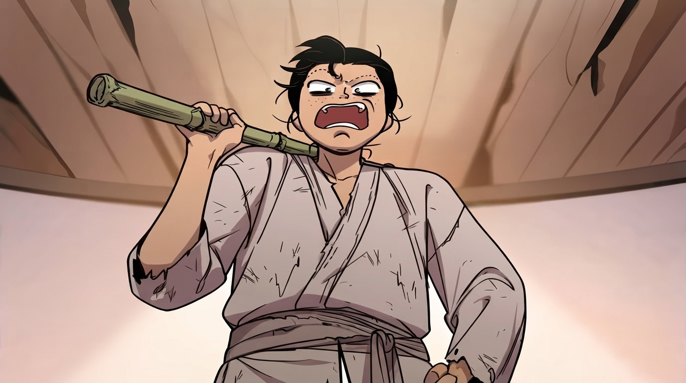
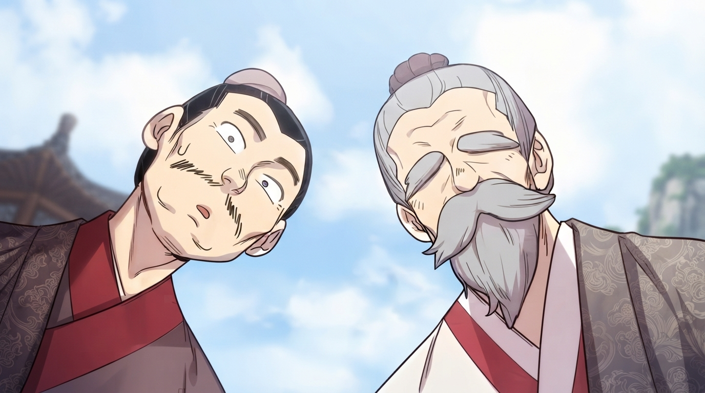
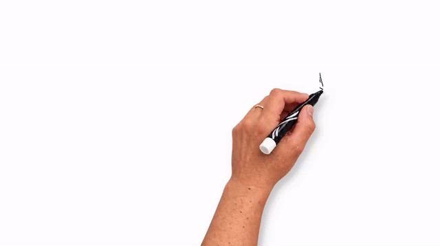
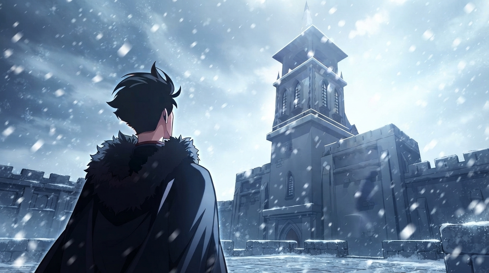
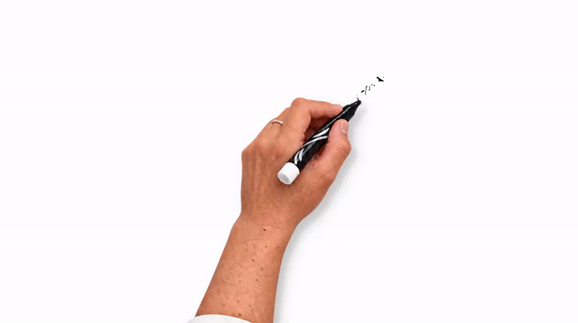

# WHITEBOARD ANIMATION VI

<p align="center">
  
</p>

**CHARACTERS FIRST · COLOR GROUPS · INK-AWARE BOUNDARIES · MOVING REAL HANDS**

Turn an illustration into a whiteboard animation: draw the lines, color the
characters first, then finish the background with moving photographic hands.

Handdraw combines **subject-first coloring, color-grouped strokes and
ink-aware region boundaries** in a local Gradio app. Upload an RGB/RGBA image,
choose the timing and style, and export an MP4.

---

## WHAT MAKES IT DIFFERENT

- **CHARACTERS BEFORE SCENERY.** SkyTNT Anime Segmentation (ISNet) separates
  the foreground. Coloring completes the detected foreground before moving
  to the background, keeping the characters visible earlier.
- **COLOR GROUPS SHAPED BY THE LINES.** Similar colors are grouped in Lab
  space, and ink boundaries help split connected regions. Brush strokes reveal
  pixels assigned to their color group. The palette controls the painting order;
  the output retains the source image's colors and shading.
- **A DELIBERATE PAINTING ORDER.** Within the foreground, finish one color
  group before switching colors. **Quick** mode then completes each background
  cluster in left-to-right order, using the original ink-aware region IDs.
- **SHORTER, SYNCHRONIZED HAND TRAVEL.** Route refinement reduces travel
  between strokes while preserving the subject/color order. Brush contact and
  pixel reveal share one timeline, with eased movement and pen lifts between
  strokes.
- **MOVING PHOTOGRAPHIC HANDS AND CLEANER LINES.** Separate drawing/coloring
  hand assets have wrist, finger and shadow motion. Multiscale contrast filtering
  and small-component cleanup reduce specks in the extracted line map.
- **LOCAL UI AND GPU RENDERING.** Native Gradio controls expose timing, lines,
  colors, hands and export options. CUDA supports palette clustering and frame
  composition; optional NVENC encodes GPU frames directly. CPU/libx264 export
  and a Python API are also available. Recent image plans are cached for reuse
  when adjusting timing or hand settings.

## SEE THE TRANSFORMATION

One original, two animation styles: **ORIGINAL → DETAILED → QUICK**.
Both modes use the same 8-second duration, a maximum frame size of 1280×720,
and **50 FPS**. The looping GIFs are 640 pixels wide.

### BAMBOO STAFF

<p align="center"><strong>ORIGINAL → DETAILED → QUICK</strong></p>
<p align="center">
   &nbsp;→&nbsp;
   &nbsp;→&nbsp;
  
</p>

### TWO CHARACTERS

<p align="center"><strong>ORIGINAL → DETAILED → QUICK</strong></p>
<p align="center">
   &nbsp;→&nbsp;
   &nbsp;→&nbsp;
  
</p>

### WINTER SCENE

<p align="center"><strong>ORIGINAL → DETAILED → QUICK</strong></p>
<p align="center">
   &nbsp;→&nbsp;
   &nbsp;→&nbsp;
  
</p>

These sample illustrations are not covered by the project's code license.
Confirm permission to redistribute them before publishing these previews.

## DRAWING MODES

| Mode | Foreground coloring | Background coloring |
| --- | --- | --- |
| **Detailed** | Complete color groups using the refined hand route. | Continue with color-group ordering and refined routing. |
| **Quick** | Keep the same foreground route and timing as Detailed. | Finish each ink-aware cluster, ordered from left to right. |

Both modes use the chosen duration and retain the same source image detail.
The difference is the background stroke order.

## HOW IT WORKS

1. Fit the image to the output frame, extract and clean its lines, and detect
   foreground when subject priority is enabled.
2. Draw the line map with the Grid path.
3. Color the detected foreground, completing one color group at a time.
   Colors are initially ordered by their first substantial occurrence near the
   top of the foreground; routing shortens travel within that order.
4. Color the background using the selected mode's route.
5. Hold the finished image and export MP4 with a JSON render report.

Line extraction uses contrast and multiscale filtering; ISNet supplies the
foreground mask. Ink boundaries are inferred from that line map.

## INSTALL (WINDOWS)

Use Python 3.11 or 3.12, 64-bit. Run these PowerShell commands from the repository:

```powershell
py -3.11 -m venv .venv
.\.venv\Scripts\python.exe -m pip install --upgrade pip
```

For NVIDIA CUDA rendering, install the matching PyTorch wheels first:

```powershell
.\.venv\Scripts\python.exe -m pip install torch==2.8.0 torchvision==0.23.0 --index-url https://download.pytorch.org/whl/cu128
.\.venv\Scripts\python.exe -m pip install -r requirements-gpu.txt
```

The CUDA wheel command follows the [official PyTorch 2.8 installation instructions](https://pytorch.org/get-started/previous-versions/#v280).
CUDA rendering requires a compatible NVIDIA driver; NVENC also requires an
NVENC-capable GPU and the optional `PyNvVideoCodec` package.

For CPU-only use:

```powershell
.\.venv\Scripts\python.exe -m pip install torch==2.8.0 torchvision==0.23.0 --index-url https://download.pytorch.org/whl/cpu
.\.venv\Scripts\python.exe -m pip install -r requirements.txt
```

Select **CPU** and **CPU H.264** in the UI. GPU defaults are not silently changed
when CUDA or NVENC is unavailable. CPU H.264 export requires FFmpeg with libx264
available on `PATH`.

## SUBJECT SEGMENTATION MODEL

Download the checkpoint explicitly before using subject segmentation:

```powershell
.\.venv\Scripts\python.exe scripts\download_model.py
```

The downloader pins revision `493cb60893f47441b26ec4fb9a306bce9e342982` of
[`skytnt/anime-seg`](https://huggingface.co/skytnt/anime-seg/tree/493cb60893f47441b26ec4fb9a306bce9e342982),
streams to a temporary file, verifies size and SHA256, then replaces the target
atomically. A verified existing file is reused. Network operations use a
30-second socket timeout and a 10-minute transfer deadline; no automatic retries.
Rendering does not implicitly download models.

Target: `assets/v181d/model.safetensors` (ignored by Git).

- Size: `203982056` bytes
- SHA256: `3351563ba8b61a01a66bacb79cf36aabce2da62d88b7606a719f573f23fe5d3e`

## RUN LOCALLY

Double-click `start.bat`, or run:

```powershell
.\start.ps1
# Another port:
.\start.ps1 -Port 7861
```

The launcher uses this repository's `.venv`, starts a hidden `pythonw.exe`
process, opens the browser, and continues running after the terminal closes.
It prints the server PID; use `Stop-Process -Id <PID>` to stop that process.
Logs are appended to `logs/app.log`.

For a foreground server:

```powershell
.\.venv\Scripts\python.exe app.py --port 7860 --open --log
# Optional custom log:
.\.venv\Scripts\python.exe app.py --log logs\session.log
```

The UI binds only to [127.0.0.1:7860](http://127.0.0.1:7860), with public sharing
and Gradio analytics disabled. Rendering is serialized; the queue holds at most
eight pending jobs. MP4 files are stored in `outputs/` and can be downloaded from
the UI. Remove old outputs manually when no longer needed.

The default drawing/hold split is 70/30. Independently, ink/fill within the
drawing phase is 45/55. Every `Settings` dataclass field is editable, using its
native label, default, bounds, step, and choices. Advanced JSON starts with the
native rig/filter defaults; protected rig and dedicated wrist keys are excluded.
The backend validates all settings before rendering.

## TESTS

```powershell
.\.venv\Scripts\python.exe -m pip install -r requirements-dev.txt
.\.venv\Scripts\python.exe -m pytest tests -q
```

Tests cover UI/settings synchronization, native planning, validation, verified
downloads, and a real CPU MP4 encode/decode. They do not download the checkpoint.

## PYTHON USAGE

```python
import numpy as np
from PIL import Image
from handdraw.settings import Settings
from handdraw.render import render_video

image = np.asarray(Image.open("input.png").convert("RGBA"))
settings = Settings(mode="e", duration=10, draw_percent=70, ink_percent=45)
video_path, report = render_video(image, settings)
```

Changing timing or hand settings reuses
the in-memory image plan; only two plans are retained. CPU uses libx264;
NVENC consumes GPU frames directly. Quick mode changes the background stroke order,
not the global video duration or the ink/fill split.

## RELATED WORK & CREDITS

The Grid path implementation derives from
[SRT Whiteboard Animation](https://github.com/geeklee/srt-whiteboard-animation).
That project provides a subtitle-driven storyboard and annotation workflow.
Handdraw develops the image-rendering workflow with automatic foreground
segmentation, color-group routing, left-to-right background clusters, animated
photographic hands and a local Gradio interface. Its current input is a single
image; SRT/storyboard orchestration remains outside this app.

Upstream notices are preserved in `vendor_runtime/` and documented in
[THIRD_PARTY_NOTICES.md](THIRD_PARTY_NOTICES.md).

## LICENSE

Original project code contributed by `letuandat131` is dedicated to the public
domain under [CC0 1.0 Universal](LICENSE). It may be used, modified and
redistributed, including commercially, without requiring attribution for that
original code.

Third-party and upstream-derived code retains its own license and notices; see
[THIRD_PARTY_NOTICES.md](THIRD_PARTY_NOTICES.md) and `vendor_runtime/`.
The CC0 dedication does not cover hand images, demo artwork or model weights.
Model weights remain a separate upstream artifact, not part of the Git checkout.
